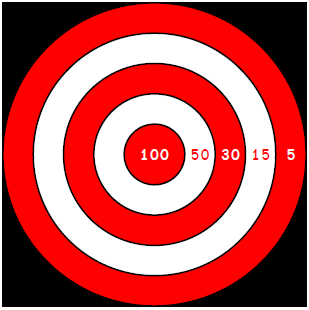
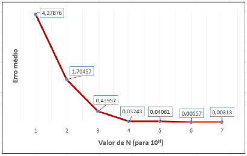

# Valor-esperado-em-um-jogo-de-dados
Trabalho final da disciplina de Algoritmo e Programação de Computadores(APC), realizado em meu 1° semestre no curso de Engenharia de Software.

Neste trabalho construímos um código que estima a pontuação obtida por um dardo jogado aleatóriamente em jogo de dardos com a seguinte distribuição de pontos:

    

O experimento aqui realizado, conhecido experimento de Monte Carlo, considera que todos os dardos jogados atingirão um alvo, para o cálculo da pontuação. 

Inicialmente, fizemos um gerador de valores aleatórios, para simular os lançamento dos dardos e filtramos somente os valores que "atingiram" algum alvo, a partir da comparação entre os valores e o raio do tabuleiro. Computamos a distribuição de pontos e somamos todos os valores. Ao fim do trabalho, comparamos o valor obtido no experimento de Monte Carlo com o valor obtido a partir do calculo da esperança a partir de uma variável aleatória.

Obtivemos um resultado muito satisfatório e a comparação final pode ser vista no Gráfico abaixo:

 Gráfico 1: Taxa de erro médio entre a esperança e a media dos valores obtidos nos testes do experimento de Monte Carlo

    

Os participantes do experimento foram:
- Gabriel Gonçalves Rocha
- Maria Alice Bernardo da Costa Silva (eu)
- Pedro Henrique dos Santos Ferreira(@pedro-hsf)
- Vinícius Mendes Martins (@yabamiah)

Demais informações sobre o tema se encontram no arquivo 'Tema - Valor esperado em um jogo de dardos' e sobre o desenvolvimento e resultados obtidos em 'Relatório de desenvolvimento do trabalho'.
